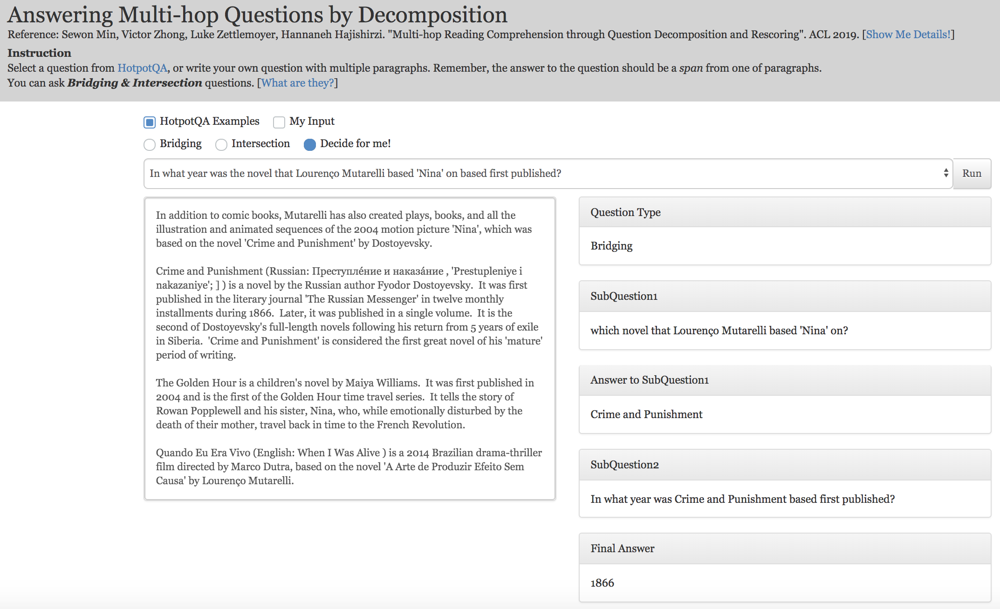
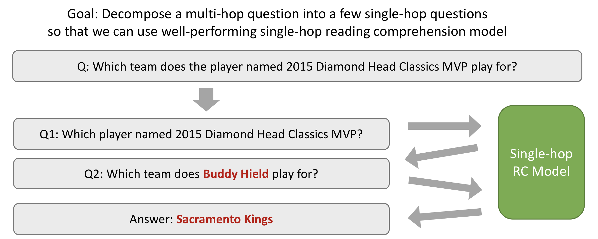
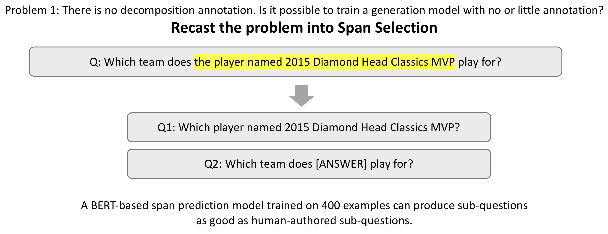
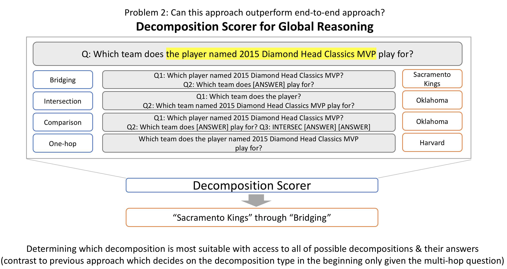

# Multi-hop Reading Comprehension through Question Decomposition and Rescoring

This is an original implementation of the following paper.
[[Paper PDF](https://arxiv.org/pdf/1906.02916.pdf)]


```
@inproceedings{ min2019multi,
  title={ Multi-hop Reading Comprehension through Question Decomposition and Rescoring },
  author={ Min, Sewon and Zhong, Victor and Zettlemoyer, Luke and Hajishirzi, Hannaneh },
  booktitle={ ACL },
  year={ 2019 }
}
```

Check out our [Demo](http://allgood.cs.washington.edu:2019/), which answers to the multi-hop question in a real time!



## Model Description

Our model, *DecompRC*, answers to the multi-hop question by decomposition. It decomposes the question into a set of sub-questions according to the reasoning type (bridging, intersection, comparison and one hop), answers each sub-question through single-hop reading comprehension model, and uses a decomposition scorer to determine the most suitable decomposition & final answer.






---

*DecompRC* was submitted to the [HotpotQA leaderboard](https://hotpotqa.github.io) in Feb, 2019 and is still the best performing model out of models submitted to both distractor setting and full wiki setting (as of Jun, 2019).

## Code description

This repo contains:
- the code for DecompRC (training & inference)
- the code for DecompRC demo
- annotated decomposition examples
- pretrained models
- intermediate output of DecompRC

This code is based on the earlier version of [Pytorch BERT implementation from HuggingFace](https://github.com/huggingface/pytorch-pretrained-BERT). For all models using BERT, we used an uncased version of BERT Base.
This code is tested on Python 3.5.2 and Pytorch 1.1.0.

## Code

The code for training the model is mainly in `DecompRC`.

Here, we describe the instruction to run the mode for (i) preprocessing, (ii) making an inference and (iii) training the model. (i) and (ii) are described here, (iii) is described  in `DecompRC/README.md`.
We highly recommend to download the pretrained model first (following the instruction in `Pretrained Model` section) and run the code for the inference before training the model, to make sure all codes run properly.

*Note*: The code for comparison questions is under construction. We release the pretrained models and intermediate outputs for the comparison questions, so please use them for now.


### Preprocessing

##### 1. Download HotpotQA data and Pretrained BERT

You can download original HotpotQA data (`train`, `dev-distractor`) from [HotpotQA website](https://hotpotqa.github.io).

You can download pretrained Tensorflow BERT from [here](https://drive.google.com/file/d/1XaMX-u5ZkWGH3f0gPrDtrBK1lKDU-QFk/view?usp=sharing). This is converted from [Google's original BERT repo](https://github.com/google-research/bert).

##### 2. Convert HotpotQA into SQuAD style

The following command converts HotpotQA into SQuAD style, and store files into `data/hotpot-all` directory.
```
python convert_hotpot2squad.py --data_dir {DATA_DIR} --task hotpot-all
```

`{DATA_DIR}` indicates the directory with `hotpot` data files. (e.g. the directory  should contain `hotpot_train_v1.json` and `hotpot_dev_distractor_v1.json`)

### Inference

If you place downloaded `DecompRC-all-models-and-data.zip`, unzip it & place `data` and `model` inside `DecompRC`, and place pytorch model of uncased BERT-Base inside `model/uncased_L-12_H-768_A-12`, you can simply do `make inference` to run all codes for the inference.

The following is the step-by-step instruction of each procedure.

##### 1. Decomposition Model
```
# Bridging
python3 main.py --do_predict --model span-predictor --output_dir out/decom-bridge \
              --init_checkpoint model/decom_bridge/model.pt \
              --predict_file data/hotpot-all/dev.json,data/decomposition-data/decomposition-bridge-dev-v1.json \
              --max_seq_length 100 --max_n_answers 1 --prefix dev_ --with_key
# Intersection
python3 main.py --do_predict --model span-predictor --output_dir out/decom-intersec \
              --init_checkpoint model/decom_intersec/model.pt \
              --predict_file data/hotpot-all/dev.json,data/decomposition-data/decomposition-intersec-dev-v1.json \
              --max_seq_length 100 --max_n_answers 1 --prefix dev_
```

You can adjust `--predict_batch_size` based on memory availability.

##### 2. Single-hop RC Model

The following is the code for bridging.
```
python3 run_decomposition.py --task decompose --data_type dev_b --out_name out/decom-bridge
python3 main.py --do_predict --output_dir out/onehop \
            --predict_file data/decomposed/dev_b.1.json \
            --init_checkpoint out/onehop/model1.pt,out/onehop/model2.pt,out/onehop/model3.pt \
            --prefix dev_b_1_ --n_best_size 4
python3 run_decomposition.py --task plug --data_type dev_b --topk 10
python3 main.py --do_predict --output_dir out/onehop \
            --predict_file data/decomposed/dev_b.2.json \
            --init_checkpoint out/onehop/model1.pt,out/onehop/model2.pt,out/onehop/model3.pt \
            --prefix dev_b_2_ --n_best_size 4
python3 run_decomposition.py --task aggregate-bridge --data_type dev_b --topk 10
```

The first command preprocesses the decomposed sub-questions according to the output from the decomposition model (stored in `out/decom-bridge`). Then, the second commands runs the RC model for the first sub-question. The third command runs the code for plugging the answer to the first sub-question into the second sub-question. Then the next command runs the RC  model for the second sub-question. Finally, the last command aggregates the outputs.

If everything runs properly, you will obtain `data/decomposed-predictions/bridge_decomposed_dev_nbest_predictions.json`.

You can go through the similar process for intersection.

```
python3 run_decomposition.py --task decompose --data_type dev_i --out_name out/decom-intersec
python3 main.py --do_predict --output_dir out/onehop
            --predict_file data/decomposed/dev_i.1.json \
            --init_checkpoint out/onehop/model1.pt,out/onehop/model2.pt,out/onehop/model3.pt \
            --prefix dev_i_1_ --n_best_size 4
python3 main.py --do_predict --output_dir out/onehop \
            --predict_file data/decomposed/dev_i.2.json \
            --init_checkpoint out/onehop/model1.pt,out/onehop/model2.pt,out/onehop/model3.pt \
            --prefix dev_i_2_ --n_best_size 4
python3 run_decomposition.py --task aggregate-intersec --data_type dev_i --topk 10
```

Note that for intersection questions, there is no plugging process.
When you are done, you will obtain `data/decomposed-predictions/intersec_decomposed_dev_nbest_predictions.json`.

Finally, for the option of `original`, the original questions are answered by RC model.

```
python3 main.py --do_predict --output_dir out/hotpot \
            --predict_file data/hotpot-all/dev.json \
            --init_checkpoint model/hotpot/model.pt --max_seq_length 300 --prefix dev_ --n_best_size 4
python3 run_decomposition.py --task onehop --data_type dev --topk 10
```

When you are done, you will obtain `data/decomposed-predictions/onehop_decomposed_dev_nbest_predictions.json`.

*Note*: Code for comparison questions is under construction. For now, please use the released intermediate outputs.

##### 3. Decomposition Scorer

```
python3 main.py --do_predict --output_dir out/scorer --model classifier \
            --predict_file data/hotpot-all/dev.json,comparison,bridge,intersec,onehop \
            --init_checkpoint model/scorer/model.pt \
            --max_seq_length 400 --prefix dev_
```

The F1 score printed from this command is the final F1 score of DecompRC on the dev set of  HotpotQA. It stores the score for each reasoning type in `out/scorer/class_scores.json`. The answer to each question is the answer from the reasoning type with maximum score.

To display the breakdown of F1 score using `prettytable` and save the final prediction file that is comparable to the submission for official HotpotQA evaluation, please run

```
python3 show_result.py --data_file {ORIGINAL_HOTPOT_DEV_FILE} --prediction_file {FILE_TO_SAVE}
```


## Demo

The code for demo is mainly in `demo` directory.
To run the demo, please install `flask 1.0.2`.
Go to `demo` directory, place `model` directory with all pretrained models inside `demo`, and run `python run-demo.py`. Then, `localhost:2019` will show a demo. You can change the port by modifying `run-demo.py`. Please note that the demo can be slow on cpu, so we recommend to run it on gpu.

Currently, the demo supports bridging and intersection.

Details of each file/directory:
- `run-demo.py`: a main python code to run the demo using Flask, which handles receiving the question and paragraphs from the user, running DecompRC and sending the sub-questions & answer.
- `templates/`: HTML file.
- `static/`: style files (including boostrap) and javascript file.
- `qa/`: codes for the model to make an inference.

## Decomposition Examples & Pretrained Models & Intermediate Outputs

To download everything altoegher, please click [here](https://drive.google.com/file/d/1p7VrJIEmUY9tAWmx31chhStS-KoRWOJQ/view?usp=sharing).
The description of each file is as follows.

##### 1. Decomposition Examples

Annotated decomposition examples can be found inside `data/decomposition-data`.

- `decomposition-bridge-{DTYPE}-v1.json` (`DTYPE`: dev/train) contains examples for reasoning type of bridging.
- `decomposition-intersec-{DTYPE}-v1.json` (`DTYPE`: dev/train) contains examples for reasoning type of intersection.

Each file is a json file containing a dictionary, which key is `data` (string) and value is a list of datapoints (200 for the training set of bridging and intersection, 152 for the development set of bridging, 66 for the development set of  intersection)

Each datapoint is a dictionary with two keys, `id` and `question`.

- `id` is an id matching with the original HotpotQA id.
- `question` is the question with annotation. All words in the question are lowercased, and the only uppercase is special tokens `S` and `K` (`K` is only for bridging). `S` indicates the start and end of the span, containing multiple words. `K` indicates the start and end of the keyword, which is always one word.

An Example of bridging

- question in the dictionary: `S alice david is the voice of lara croft in a video K game K S developed by which company ?`
- original question: `alice david is the voice of lara croft in a video game developed by which company?`
- annotated span: `alice david is the voice of lara croft in a video game?`
- annotated keyword: `game`
- desired decomposition: (1) `alice david is the voice of lara croft in which video game ?` (2) `[ANSWER] developed by which company ?`

An Example of intersection

- question in the dictionary: `what former city, S now the fourth - largest russian city S , was the belarusian state technological university evacuated to in 1941?`
- original question:: `what former city, now the fourth - largest russian city , was the belarusian state technological university evacuated to in 1941?`
- annotated span: `now the fourth - largest russian city`
- desired decomposition: (1) `what former city is now the fourth - largest russian city` (2) `what former city was the belarusian state technological university evacuated to in 1941?`

For full details of the definition of bridging and intersection, decomposition method and annotation procedure, please see the paper.

##### 2. Pretrained Models

All pretrained models can be found in `model`.

- `decom_bridge`: a decomposition model for bridging questions.
- `decom_intersec`: a decomposition model for intersection questions.
- `hotpot`: a BERT-based reading comprehension model trained on HotpotQA. This is used as a baseline in the paper.
- `onehop`: a BERT-based reading comprehension model trained on SQuAD (augmented with Wikipedia articles retrieved by TF-IDF to make it multi-paragraph setting) and HotpotQA easy. contains three different models for ensemble.
- `scorer`: a decomposition scorer

For full details of each model, please see the paper.

##### 3. Intermediate Outputs

We also release the intermediate outputs for people hoping to save time to make an inference on the training data. Files can be found in `data/decomposition-predictions`

The name of the file is in a format of `{RTYPE}_decomposed_{DTYPE}_nbest_predictions.json`, where `{RTYPE}` indicates the reasoning type (bridge,intersec,comparison,onehop) and `{DTYPE}` indicates the data type (train,dev).

## Contact

For any question, please contact [Sewon Min](https://shmsw25.github.io).

